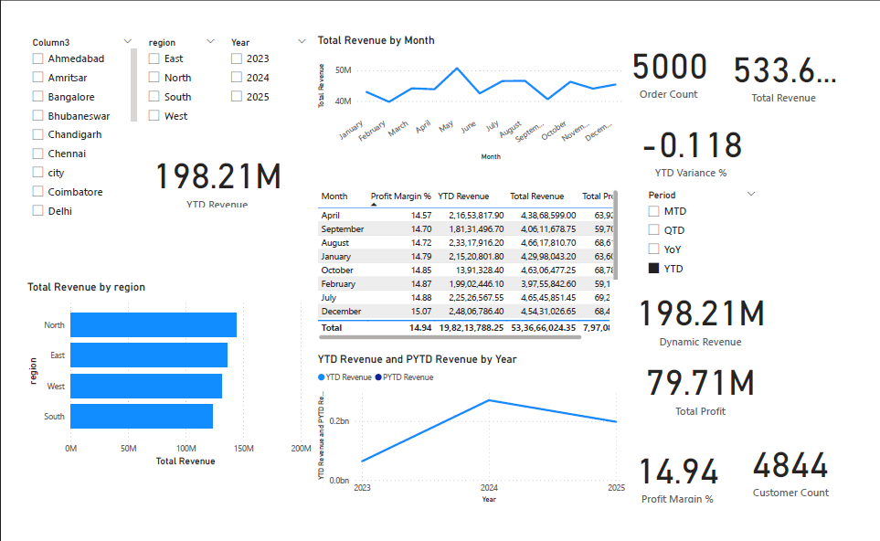
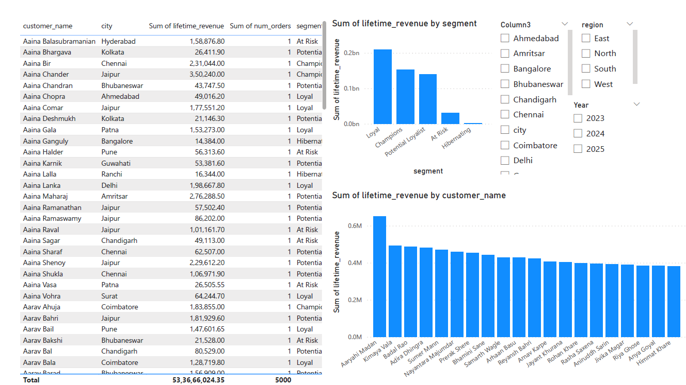

# E-commerce Sales & Customer Analytics

## 1. Project Overview
Short paragraph: what business problem this solves.

## 2. Tech Stack
- Python (pandas, numpy, matplotlib, seaborn)
- Power BI (DAX, data modeling, time intelligence)
- SQL (optional, if used)
- Git & GitHub

## 3. Business Questions
- How are revenue and profit evolving over time?
- Which regions/categories drive revenue and margin?
- What is customer LTV and how is it distributed?
- How are customer cohorts performing over time?
- Which products and segments deserve focus?

## 4. Data Pipeline
1. Raw CSV in `data/raw/`
2. Cleaning & transformation in `notebooks/01_data_cleaning.ipynb`
3. Customer metrics, cohorts, and RFM in notebooks 3 and 4
4. Exported CSVs in `data/processed/`
5. Power BI dashboard (`dashboard/ecommerce_analytics.pbix`) using these tables

## 5. Power BI Dashboards

### Overview Page
- KPIs: Total Revenue, Total Profit, Order Count, Customer Count, Profit Margin %
- Time intelligence: YTD, PYTD, YoY, dynamic period selector (MTD/QTD/YTD/YoY)
- Revenue breakdown by region and category



### Customers Page
- Customer LTV, number of orders, and lifetime days
- Revenue by segment and country
- RFM segments (Champions, Loyal, At Risk, etc.)



### Cohorts & RFM Page
- Monthly cohort retention heatmap
- RFM revenue by segment and Champions share


## 6. Folder Structure

```text
ecommerce-sales-customer-analytics/
├── data/
│   ├── raw/              # Original dataset(s)
│   └── processed/        # Clean tables, cohort & RFM exports
├── notebooks/            # Jupyter notebooks (cleaning, EDA, customers, cohorts, RFM)
├── sql/                  # (Optional) SQL queries for metrics
├── src/                  # Python scripts (e.g. load_to_sqlite)
├── dashboard/
│   ├── ecommerce_analytics.pbix
│   └── screenshots/
├── docs/                 # ERD, notes, etc.
├── requirements.txt
└── README.md
